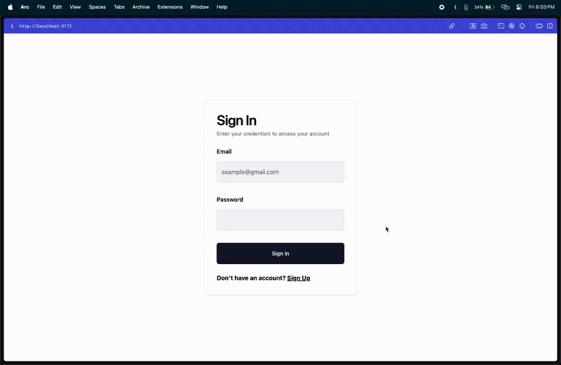

# webspero-assignment

## DEMO



## This project uses the following technologies

### Backend

- `Node.js` for server
- `Express` for routing
- `MongoDB` for database
- `Mongoose` for ODM
- `jsonwebtoken` for authentication
- `zod` for validation
- `bcrypt` for password hashing

### Frontend

- `React` for UI
- `Vite` for build tool
- `Redux Toolkit` for state management
- `React Router` for routing
- `Tailwind CSS` for styling
- `Shadcn UI` for UI components
- `zod` for validation

## 🛠️ Installation Steps:</h2>

1. Clone the repository
2. Navigate to the backend directory and run `npm install` to install backend dependencies
3. Create a `.env` file in the backend directory and set up environment variables:

   ```.env
       PORT=the port on which the backend server will run
       MONGODB_URI=the URI of the MongoDB database
       JWT_SECRET=the secret used to sign JWT tokens
   ```

4. Navigate to the frontend directory and run `npm install` to install frontend dependencies

5. Start the backend server by running `npm start` in the backend directory

6. Start the frontend development server by running `npm run dev` in the frontend directory

7. Open your browser and go to `http://localhost:5173/` to view the application
